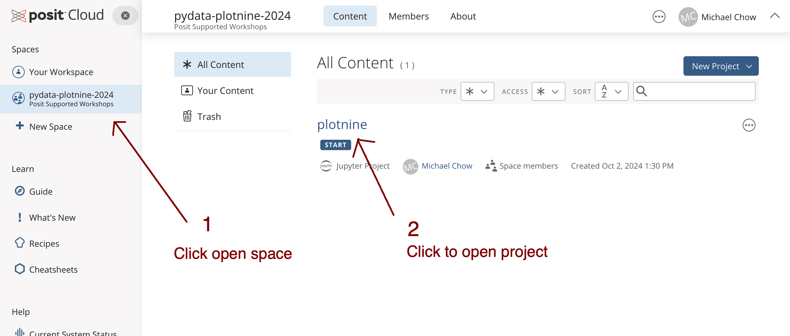
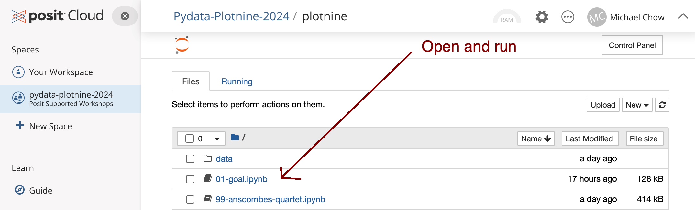

# Plotnine Tutorial PyData NYC 2024

In order to follow along, it's important to get everything set up, preferably before the workshop starts.
You have two options: (a) use Posit Cloud (where everything is already installed) or (b) use your own laptop (and install everything locally).

## Option A: Posit Cloud Setup

### Step 1: Join the Posit Cloud Workshop Space

First, join our Posit Cloud space by clicking the link below:

- https://posit.cloud/spaces/563461/join?access_code=AhY1OPahcAHE0bO3_hyzWodjdktNm3kkmxHg1zb4

The link should bring you to a login page.
Either log in, or create a new account for free if you don't have one.
After logging in, you should see the `pydata-plotnine-2024` work space.



Once you click into the "plotnine" project, you should see Jupyter listing all the notebooks for the workshop:



### Step 2: Run Example Notebook

Click the _01-goal.ipynb_ notebook to open.
Everything should be set up for you to run the code in the notebook right away.

## Option B: Local Setup

We recommend using `uv`, but if you prefer to use something else, then that's fine too.

### Step 1: Install Package Manager `uv`

```
curl -LsSf https://astral.sh/uv/install.sh | sh
```

### Step 2: Create Virtual Environment

```
uv venv -p 3.12
source .venv/bin/activate
```

### Step 3: Install Packages

```
uv sync
```

### Step 4: Run Jupyter Lab

```
uv run -- jupyter lab
```

### Step 5: Run Example Notebook

Once you're set up, confirm that everything works by running the notebook _01-goal.ipynb_.

